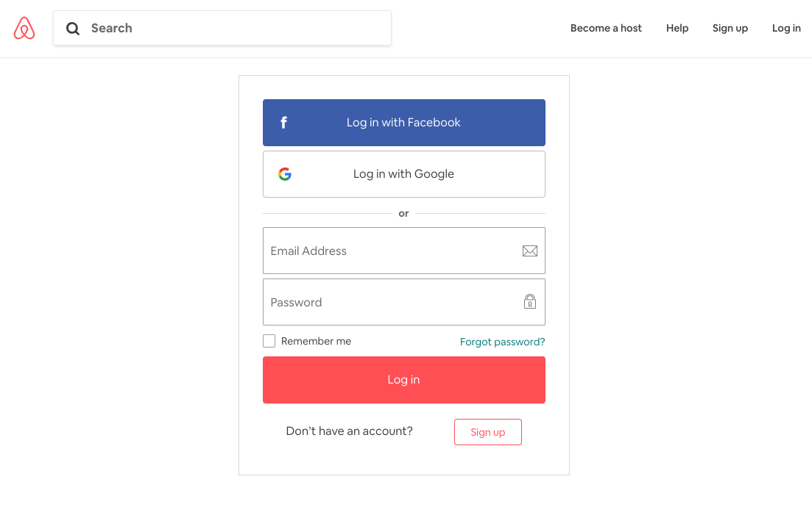
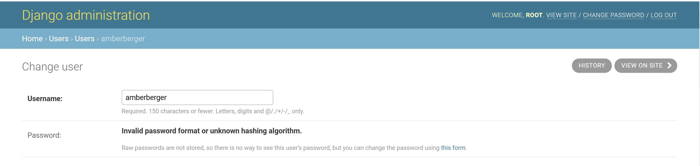

# 7. Web Design

## 19 Intro to Tailwind CSS

### What is Gulp?

- SCSS -> ugly CSS
- New JavaScript -> Old JavaScript
- Pug.js -> ugly HTML
- uploading to github automization

we do not utilize babel nor yarn for this project

```shell
npm init
npm install gulp gulp-postcss gulp-sass gulp-csso node-sass auto-prefixer -D
npm install tailwindcss -D
```

- If you don't do npm init, then node modules will be installed in upper directory with npm on it
- initialize tailwind css

```shell
npx tailwindcss init
```

### Compile scss to css

- make alias on package.json

  ```json
  "scripts": {
      "css": "gulp"
    }
  ```

- compile scss into css file

  ```shell
  npm run css
  ```

### Integrating css to HTML

- static path: http://127.0.0.1:8000/static/css/styles.css

- loading static path to html: replacing http://127.0.0.1:8000/static to tag {static}

  ```html
   <link rel="stylesheet" href="">
  ```

- CSS is already done by tailwind css at styles.css

- Call tailwind css by using class="tailwind-css-classname"
  [Refer tailwind css document for classnames](https://tailwindcss.com/docs/border-color)

- em is relative to closest font-size

- rem is relative to root font size

## 20 Design

### [Cloning Airbnb login](./templates/users/login.html)

- Example page for Cloning

  

## 21 User Profile, Edit Profile, Change Password

### [The messages framework](https://docs.djangoproject.com/en/3.0/ref/contrib/messages/)

- Quite commonly in web applications, you need to display a one-time notification message (also known as “flash message”) to the user after processing a form or some other types of user input

- The default [settings.py](../config/settings.py) created by django-admin startproject already contains all the settings required to enable message functionality

### Adding messages

- To use the message, import it to [views.py](../users/views.py) first

  ```shell
  from django.contrib import messages

  ....

  messages.error(request, e)
  ```

- Some shortcut methods provide a [standard way](https://docs.djangoproject.com/en/3.0/ref/contrib/messages/#adding-a-message) to add messages with commonly used tags (which are usually represented as HTML classes for the message)

### Django get_absolute_url()

- When it comes to web development you really want to avoid hard coding paths in your templates

- This method enables admin panel to work "View on site" link

  

[Example of absolute url](../templates/partials/nav.html):

```HTML
<!-- hard coding url -->
 <li class="nav_link"><a href="{}">Profile</a></li>

<!-- absolute url -->
 <li class="nav_link"><a href="{{user.get_absolute_url}}">Profile</a></li>
```

### [Adding messages in class-based views](https://docs.djangoproject.com/en/3.0/ref/contrib/messages/#adding-messages-in-class-based-views)

- Adds a success message attribute to FormView based classes

Example [views.py](../users/views.py):

```shell
from django.contrib.messages.views import SuccessMessageMixin

...

class LoginView(mixins.LoggedOutOnlyView, FormView):
```

- You can also use customizing messages through [mixins](https://docs.djangoproject.com/en/3.0/topics/auth/default/#django.contrib.auth.mixins.UserPassesTestMixin)
  - You can use this when you want to send a different kind of message instead of a success message
  - Example: [mixins.py](../users/mixins.py)

### Mixins

- This can prevent users from accessing the wrong page through url manipulation

Example [mixins.py](../users/mixins.py):

```shell
from django.contrib.auth.mixins import UserPassesTestMixin, LoginRequiredMixin

...

class EmailLoginOnlyView(UserPassesTestMixin):
```

## 22 Room Detail

### [Pluralize](https://docs.djangoproject.com/en/3.0/ref/templates/builtins/#pluralize)

- Returns a plural suffix if the value is not 1, '1', or an object of length 1. By default, this suffix is 's'

Example [room_detail.py](../templates/rooms/room_detail.html):

```HTML
<span class="mr-5 font-light">{{room.beds}} bed{{room.beds|pluralize}}</span>
```
